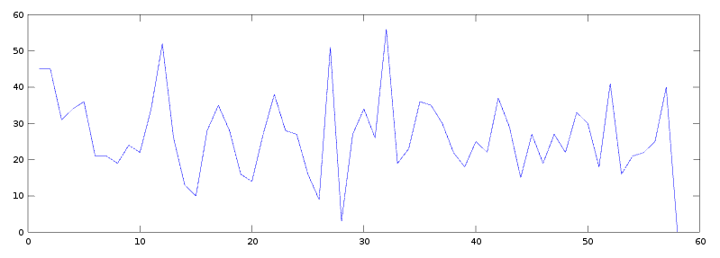

HenHouse
========================

HenHouse is a proof of concept for creating a fast time series DB that can compute
sum, average, and variance between any two time ranges in basically constant time. 

Limitation with the design is that pushing data to the DB must happen in the last
timestamp range because the DB stores a sums and sum of squares table along with
actual values.

Design
=========================

There is an index and time data for each "key". The key, index and data together make a 
timeline. Time ranges are broken up as continuous frames with buckets at a given 
time resolution. Each bucket contains the value of counts in that bucket, 
a sum up to that bucket of all values, and a sum of squared values up to that bucket. 
This is a 1D version of a summed area table with a second integral.

Given two time ranges, you can compute sum, average, and variance in constant time.

The index and data structures store the data using memory mapped files
for optimal performance.

Complexity Analysis
==========================

Finding a time range inside the index is O(log(n)) because binary search is used
for finding the index entry. 

Once two time ranges are found, then finding a bucket within the range is constant time
since it is an offset from start based on bucket resolution. 

Computing the sum, average, and variance between two found buckets is constant time
since the sums and sum of squares up to that point are stored in the bucket. 
The sum and sum of squares operation then become a simple subtraction.

Inserting an entry to the DB is constant time since only inserts into the last
time range are allowed. Since time ranges are fixed size, then worst case
is that an entry is inserted into the first bucket in the range. The overall insert
operation is constant time since the bucket size is fixed no matter the size of
the data.

Building
==========================

Download Dependencies.

- [boost](boost.org) 
- [wangle](https://github.com/facebook/wangle)
- [folly](https://github.com/facebook/folly)
- [proxygen](https://github.com/facebook/proxygen)

Go to henhouse project directory and
run...

    mkdir build
    cmake ..
    make -j
    ./src/henhouse/henhouse

